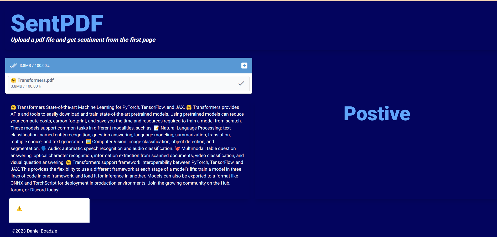

# SentPDF

> Upload a pdf file and get sentiment from the first page



## How to run it

### Setp 1: Create a virtualenv

```bash
python -m venv .venv
```

### Setp 2: Activate the virtualenv

```bash
source /venv/bin/activate #linux
```

### Setp 3: Install dependencies

```bash
pip install -r requirements.txt
```

### Setp 4: Run the app

```bash
python app.py
```

### Setp 5: Visit `localhost:8080` and see the app
